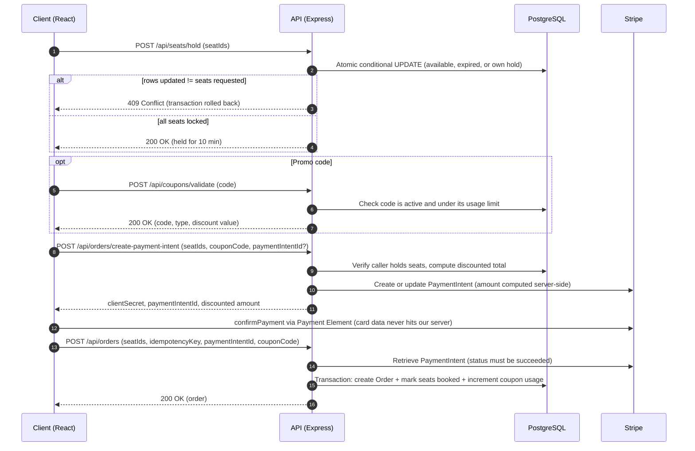
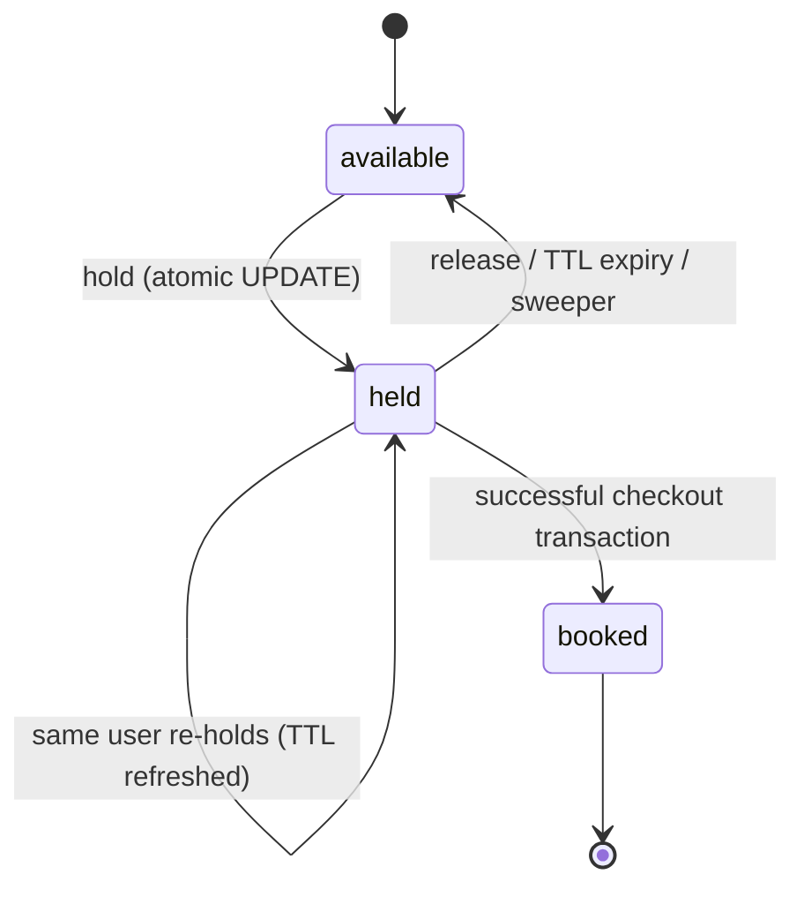

# Evently

**A full-stack event discovery and seat-reservation platform engineered around one hard problem: never selling the same seat twice.**


---

## Table of Contents

1. [Overview](#overview)
2. [Feature Status](#feature-status)
3. [System Design](#system-design)
4. [Concurrency Model](#concurrency-model)
5. [Data Model](#data-model)
6. [API Reference](#api-reference)
7. [Security](#security)
8. [Tech Stack](#tech-stack)
9. [Project Structure](#project-structure)
10. [Getting Started](#getting-started)
11. [Configuration](#configuration)
12. [Testing](#testing)
13. [Design Decisions & Trade-offs](#design-decisions--trade-offs)
14. [Future Improvements](#future-improvements)
15. [License](#license)

---

## Overview

Evently lets attendees browse events, pick specific seats on an interactive map, pay via Stripe (with optional promo codes), and receive a digital ticket. Organizers get a dashboard to create and manage events, view attendees, track sales, and run promo codes, with images processed through Cloudinary.

The engineering focus is **correctness under contention**: when many users race for the same seats, exactly one wins, losers get a clean `409 Conflict`, and abandoned holds are released automatically.

---

## Feature Status

Legend: ✅ implemented end to end · 🧪 UI prototype or partial (not backed by real data or persistence yet)

| Area          | Capability                                                                                                                                           | Status |
| :------------ | :--------------------------------------------------------------------------------------------------------------------------------------------------- | :----: |
| **Booking**   | Atomic multi-seat hold with 10-minute TTL                                                                                                            |   ✅   |
|               | Expired-hold reclamation (on-demand + periodic sweep)                                                                                                |   ✅   |
|               | Stripe PaymentIntent checkout (Payment Element)                                                                                                      |   ✅   |
|               | Promo code validation and server-side price recalculation (percentage or flat)                                                                       |   ✅   |
|               | Idempotent order creation (DB-enforced unique key)                                                                                                   |   ✅   |
|               | Atomic order + seat-booking transaction (also increments coupon usage)                                                                               |   ✅   |
|               | Digital ticket page with per-seat QR code                                                                                                            |   ✅   |
|               | Selected event, seats, and completed order survive page refresh (`sessionStorage`)                                                                   |   ✅   |
| **Auth**      | Signup / login, JWT (7 day), bcrypt, role-based access (`user`, `organizer`, `admin`)                                                                |   ✅   |
| **Organizer** | Event CRUD with ownership checks, auto-generated seat grid                                                                                           |   ✅   |
|               | Image upload: MIME + magic-byte validation, Cloudinary 16:9 pipeline                                                                                 |   ✅   |
|               | Attendee roster from booked seats (shows sample rows while no bookings exist)                                                                        |   ✅   |
|               | Attendee roster CSV export (client-side)                                                                                                             |   ✅   |
|               | Attendee check-in toggle                                                                                                                             |   🧪   |
|               | Sales KPIs from booked seats: tickets sold, gross sales, sell-through rate, per-event occupancy                                                      |   ✅   |
|               | Revenue trend chart and month-over-month growth badges                                                                                               |   🧪   |
|               | Promo code manager: create, list, and delete codes with usage caps (percentage or flat)                                                              |   ✅   |
| **Discovery** | Public listing of `Live` events, categories, search, detail pages                                                                                    |   ✅   |
| **UX**        | Global toast system (success, error, warning, info) and modal dialogs (celebration, destructive confirmation); no native browser `alert` / `confirm` |   ✅   |
| **DevOps**    | Docker Compose development containers (client + server)                                                                                              |   ✅   |

> The check-in toggle changes local UI state only and is not saved. The revenue trend chart is a static illustration, and the growth percentages are placeholders. The KPI cards and per-event occupancy bars are computed from real booked-seat counts.

---

## System Design

### Booking flow



### Seat lifecycle



---

## Concurrency Model

Naive reservation code reads a seat's status, checks it in application code, then writes. Two requests can both read `available` and both write. Evently collapses check and write into a **single conditional `UPDATE`**, so the database arbitrates the race:

```javascript
const result = await tx.seat.updateMany({
  where: {
    id: { in: seatIds },
    event: { status: "Live" },
    OR: [
      { status: "available" },
      {
        status: "held",
        OR: [
          { expiresAt: { lt: new Date() } }, // abandoned hold
          { userId: req.user.id }, // caller's own hold (refresh)
        ],
      },
    ],
  },
  data: { status: "held", userId: req.user.id, expiresAt: expireTime },
});

if (result.count !== seatIds.length) throw new Error("SEATS_UNAVAILABLE");
```

**Why this is safe.** Under PostgreSQL's default `READ COMMITTED` isolation, a concurrent `UPDATE` touching the same row blocks until the first transaction commits, then re-evaluates its `WHERE` clause against the committed row. The loser sees a seat that is now `held` by someone else and unexpired, matches zero rows, and the `count` check aborts the whole transaction. Multi-seat holds are all-or-nothing.

**Correctness does not depend on the sweeper.** Expired holds are reclaimable directly inside the hold query. The 60-second background sweep (`setInterval` in `server.js`) only keeps the seat map accurate for readers.

**Checkout re-validates.** `POST /api/orders` re-checks that every seat is still held by the caller and unexpired, then flips seats to `booked` inside a transaction and asserts the updated row count. A hold that lapsed mid-payment fails loudly rather than double-selling.

**Idempotency.** `Order.idempotencyKey` has a database `UNIQUE` constraint. A retried request returns the original order if the same user and same seat set match, `403` if the key belongs to another user, and `409` if it was used for a different seat set. A unique-violation race (`P2002`) is resolved the same way.

---

## Data Model

```mermaid
erDiagram
    USER ||--o{ EVENT : organizes
    USER ||--o{ ORDER : places
    USER ||--o{ SEAT : holds
    USER ||--o{ COUPON : manages
    EVENT ||--o{ SEAT : contains
    ORDER ||--o{ SEAT : includes

    USER {
        string id PK
        string email UK
        string password "bcrypt hash"
        string role "user | organizer | admin"
    }
    EVENT {
        string id PK
        string title
        int price "INR, per seat"
        int capacity
        string status "Live | Draft | Past"
        string createdBy FK
    }
    SEAT {
        string id PK
        string row
        int col
        string status "available | held | booked"
        datetime expiresAt
        string eventId FK
        string userId FK
        string orderId FK
    }
    ORDER {
        string id PK
        int totalPaid
        string idempotencyKey UK
        string status
        string userId FK
    }
    COUPON {
        string id PK
        string code UK
        string type "percentage | flat"
        int discount
        int maxUses
        int used
        boolean active
        string createdBy FK
    }
```



`Seat` carries a composite unique constraint on `(eventId, row, col)`. Seat grids are generated at event creation: up to rows A–J, with `ceil(capacity / 10)` columns, truncated to exactly `capacity` seats.

Coupons are platform-wide: a code created by any organizer is accepted for any event, and `Coupon.used` is incremented inside the checkout transaction.

---

## API Reference

Base URL: `http://localhost:5000`. Protected routes expect `Authorization: Bearer <jwt>`.

### Health

| Method | Path          | Description                                                                                          |
| :----- | :------------ | :--------------------------------------------------------------------------------------------------- |
| GET    | `/api/health` | Database connectivity check; returns status and query latency (`503` if the database is unreachable) |

### Auth: `/api/auth` (10 requests / 15 min)

| Method | Path      | Description                                                             |
| :----- | :-------- | :---------------------------------------------------------------------- |
| POST   | `/signup` | Register (`name`, `email`, `password` ≥ 6 chars). Returns JWT and user. |
| POST   | `/login`  | Authenticate. Returns JWT and user.                                     |

### Events: `/api/events`

| Method | Path                   | Access           | Description                                                                                |
| :----- | :--------------------- | :--------------- | :----------------------------------------------------------------------------------------- |
| GET    | `/`                    | Public           | List `Live` events                                                                         |
| GET    | `/:id`                 | Public           | Event detail with organizer info                                                           |
| POST   | `/`                    | Organizer, Admin | Create event (`multipart/form-data`, field `img`); seeds seat grid in the same transaction |
| PUT    | `/:id`                 | Owner, Admin     | Update; capacity is locked once any seat is held or booked                                 |
| DELETE | `/:id`                 | Owner, Admin     | Delete; refused if confirmed bookings exist (mark the event `Past` instead)                |
| GET    | `/my-events`           | Organizer, Admin | Events created by the caller, each with `soldCount` (booked seats)                         |
| GET    | `/organizer/attendees` | Organizer, Admin | Booked seats with attendee and order info (Admin sees all events)                          |

### Seats: `/api/seats`

| Method | Path        | Access                   | Description                                                 |
| :----- | :---------- | :----------------------- | :---------------------------------------------------------- |
| GET    | `/:eventId` | Public                   | Seat map (`id`, `row`, `col`, `status`)                     |
| POST   | `/hold`     | Authenticated (10 / min) | Atomically hold `seatIds`. `409` if any seat is unavailable |
| POST   | `/release`  | Authenticated            | Release the caller's own held seats                         |

### Orders: `/api/orders`

| Method | Path                     | Access        | Description                                                                                                                  |
| :----- | :----------------------- | :------------ | :--------------------------------------------------------------------------------------------------------------------------- |
| POST   | `/create-payment-intent` | Authenticated | Validate holds, apply coupon, compute total server-side, create or update the Stripe PaymentIntent                           |
| POST   | `/`                      | Authenticated | Finalize order (`seatIds`, `idempotencyKey`, `paymentIntentId`, `couponCode`); max 10 seats; atomic booking and coupon usage |
| GET    | `/`                      | Authenticated | Caller's order history                                                                                                       |

### Coupons: `/api/coupons`

| Method | Path        | Access           | Description                                                                               |
| :----- | :---------- | :--------------- | :---------------------------------------------------------------------------------------- |
| POST   | `/validate` | Authenticated    | Check a code is active and under its usage limit; returns code, type, and discount value  |
| GET    | `/`         | Organizer, Admin | List the caller's coupons with usage counters and active status                           |
| POST   | `/`         | Organizer, Admin | Create a code (`code`, `discount`, `type`: `percentage` or `flat`, `maxUses`, default 50) |
| PUT    | `/:id`      | Organizer, Admin | Update a coupon's code, discount value, and usage cap                                     |
| DELETE | `/:id`      | Organizer, Admin | Delete a coupon (creator only)                                                            |

**Pricing:** `total = max(0, price × seats − couponDiscount + ₹19 platform fee)`, computed on the server. A percentage coupon takes `round(subtotal × discount / 100)`; a flat coupon is capped at the subtotal. The client never sends a total, and any total it might display is ignored. Stripe amounts are sent in paise (`× 100`), currency `inr`.

All `/api/*` routes are additionally covered by a global limiter (150 requests / 15 min).

---

## Security

| Concern                          | Implementation                                                                                                   |
| :------------------------------- | :--------------------------------------------------------------------------------------------------------------- |
| **Authentication**               | JWT (7-day expiry); server refuses to start without `JWT_SECRET`                                                 |
| **Password storage**             | `bcryptjs`, cost factor 10                                                                                       |
| **Authorization**                | Role middleware (`authorizedRole`) plus ownership checks on event update/delete and coupon delete                |
| **Rate limiting**                | Global (150 / 15 min), auth (10 / 15 min), seat hold (10 / min)                                                  |
| **Payment data**                 | Stripe Payment Element; card details never reach the application server                                          |
| **Upload hardening**             | 2 MB cap, single file, MIME allow-list, **magic-byte signature check** (JPEG / PNG / WebP), Cloudinary re-encode |
| **CORS**                         | Restricted to `CLIENT_URL`                                                                                       |
| **Error handling**               | Centralized handler; stack traces suppressed when `NODE_ENV=production`; `X-Powered-By` disabled                 |
| **Server-authoritative pricing** | Totals, coupon discounts, and seat ownership are derived server-side, never trusted from the client              |

---

## Tech Stack

| Layer            | Technologies                                                                                                      |
| :--------------- | :---------------------------------------------------------------------------------------------------------------- |
| **Frontend**     | React 19, Vite 8, React Router 7, Tailwind CSS 4, HeroUI, Framer Motion, React Hook Form, Lucide, Stripe Elements |
| **Backend**      | Node.js (ES Modules), Express 5, Prisma 7 with `@prisma/adapter-pg`, `pg` pool                                    |
| **Database**     | PostgreSQL (developed against Neon serverless)                                                                    |
| **DevOps**       | Docker and Docker Compose (development containers)                                                                |
| **Integrations** | Stripe (payments), Cloudinary (image storage and transforms), QRServer (QR rendering)                             |

---

## Project Structure

```
Evently/
├── docker-compose.yml           # Dev containers for client and server (source mounted)
├── client/                      # React 19 SPA
│   ├── Dockerfile
│   └── src/
│       ├── components/          # Feature-grouped UI (SeatSelection, Checkout, Organizer, ...)
│       ├── context/             # BookingContext (event, seats, order), ToastContext (toasts, modals)
│       ├── pages/               # Route-level screens (Discover, Seats, Checkout, Dashboard, Discounts, ...)
│       └── utils/api.js         # API base URL configuration
└── server/
    ├── Dockerfile
    ├── config/                  # Prisma client (pg driver adapter), role constants
    ├── controllers/             # auth, event, seat, order, coupon business logic
    ├── middleware/              # auth, rate limiting, uploads + signature checks, error handling
    ├── routes/                  # Express routers (auth, events, seats, orders, coupons)
    ├── prisma/                  # schema.prisma, migrations, seed.js
    └── server.js                # App bootstrap, health check, expiry sweeper, graceful shutdown
```

---

## Getting Started

### Prerequisites

- Node.js 20.19+ (22 LTS recommended)
- A PostgreSQL database (local or [Neon](https://neon.tech))
- A [Stripe](https://dashboard.stripe.com/test/apikeys) account (test mode)
- A [Cloudinary](https://cloudinary.com) account (for image uploads)

### Option A: Docker Compose (development containers)

The compose file starts the API and the Vite dev server with your source mounted for live reload. It does **not** include a database, so point `DATABASE_URL` at Neon or any reachable PostgreSQL instance.

```bash
git clone https://github.com/ShubhamShuklaX/Evently.git
cd Evently

cp server/.env.example server/.env     # fill in the values (see Configuration)
cp client/.env.example client/.env

docker compose up --build

# In another terminal, create the schema and seed demo data (first run only)
docker compose exec server npx prisma db push
docker compose exec server npx prisma db seed
```

- Frontend: `http://localhost:5173`
- Backend API: `http://localhost:5000`

### Option B: Manual setup

#### 1. Clone

```bash
git clone https://github.com/ShubhamShuklaX/Evently.git
cd Evently
```

#### 2. Backend

```bash
cd server
cp .env.example .env        # then fill in the values (see Configuration)
npm install
npx prisma generate
npx prisma db push          # creates the full schema
npx prisma db seed          # optional: demo users + 50 events
npm run dev                 # http://localhost:5000
```

> **Note:** use `db push` rather than `migrate deploy` for now. The checked-in migrations create only the `Event` and `User` tables; `Seat`, `Order`, `Coupon`, and several `Event` columns are not yet captured in a migration.

#### 3. Frontend

```bash
cd ../client
cp .env.example .env        # then fill in the values
npm install
npm run dev                 # http://localhost:5173
```

### Try the checkout

Use Stripe's test card `4242 4242 4242 4242` with any future expiry and any CVC. To test discounts, sign in as the organizer, create a code under **Discounts**, then apply it on the checkout page.

### Seeded accounts

`npx prisma db seed` creates two users, `admin@evently.com` (role `admin`) and `organizer@evently.com` (role `organizer`). Their passwords come from `ADMIN_PASSWORD` and `ORGANIZER_PASSWORD` in `server/.env`. Regular users can self-register through the UI.

The seed also inserts 50 events across Music, Technology, Comedy, Theatre, Sports, Festival, and Food & Drink, each with a 20-seat grid (rows A–D, seats 1–5). A few events are seeded as `Draft` and are hidden from public listings.

---

## Configuration

### Server (`server/.env`)

| Variable             | Required | Description                                                     |
| :------------------- | :------: | :-------------------------------------------------------------- |
| `DATABASE_URL`       |    ✅    | PostgreSQL connection string                                    |
| `JWT_SECRET`         |    ✅    | JWT signing secret. The server exits on startup if unset        |
| `STRIPE_SECRET_KEY`  |    ✅    | Stripe secret key (`sk_test_...`). Required for payment intents |
| `CLOUDINARY_URL`     |    ✅    | `cloudinary://<api_key>:<api_secret>@<cloud_name>`              |
| `CLIENT_URL`         |          | Allowed CORS origin (default `http://localhost:5173`)           |
| `PORT`               |          | HTTP port (default `5000`)                                      |
| `ADMIN_PASSWORD`     |          | Seed password for the admin account                             |
| `ORGANIZER_PASSWORD` |          | Seed password for the organizer account                         |
| `NODE_ENV`           |          | Set to `production` to suppress stack traces in error responses |

### Client (`client/.env`)

| Variable                      | Required | Description                                        |
| :---------------------------- | :------: | :------------------------------------------------- |
| `VITE_STRIPE_PUBLISHABLE_KEY` |    ✅    | Stripe publishable key (`pk_test_...`)             |
| `VITE_API_URL`                |          | Backend base URL (default `http://localhost:5000`) |

---

## Testing

A concurrency test fires competing hold requests for the same seat in parallel and asserts that exactly one succeeds:

```bash
cd server
npm test
```

Prerequisites: the backend dependencies installed, a configured `server/.env`, and a seeded database.

Representative output:

```
  User A HTTP Response: 200 -> {"message":"Successfully held seats","count":1}
  User B HTTP Response: 409 -> {"error":"One or more seats are no longer available"}

   - Successful Reservations (200 OK): 1
   - Rejected Conflicts (409 Conflict): 1

✅ SUCCESS: Zero double-booking detected!
```

---

## Design Decisions & Trade-offs

- **Conditional `UPDATE` over explicit row locks or Redis.** It keeps correctness inside the system of record, needs no extra infrastructure, and is a single round trip. The cost is that contention is resolved by Postgres row locks, which is fine at this scale but is the first thing to revisit for very large on-sales (virtual waiting room, queueing).
- **Lazy expiry plus periodic sweep.** Reclaiming expired holds inside the hold query removes any dependency on a worker for correctness; the sweeper is purely cosmetic for seat-map accuracy. The sweeper runs in-process, so it is per-instance (harmless when duplicated, since the update is idempotent).
- **Server-authoritative totals and discounts.** The client sends seat IDs and an optional coupon code. Subtotal, discount, fee, and the Stripe amount are all calculated on the backend, and coupon usage is incremented in the same transaction that books the seats.
- **Driver adapter for Prisma.** `@prisma/adapter-pg` with an explicit `pg` pool gives control over pool size and timeouts, which matters on serverless Postgres poolers.
- **Seat identity is a row, not a counter.** Selling specific seats (rather than decrementing a stock number) is what makes the map, holds, and per-seat tickets possible, at the cost of one row per seat.

---

## Future Improvements

Planned next steps to take Evently toward higher production scale:

- **Webhooks and async payments:** Stripe webhooks (`payment_intent.succeeded`) as fulfillment redundancy, plus automated refund and cancellation flows.
- **Real-time seat sync:** the seat map is currently fetched on page load; a WebSocket or Server-Sent Events feed would push locks and releases to open browsers.
- **Door check-in:** persist attendee check-in and issue signed, order-bound QR codes (today the QR encodes only the seat label) with a scanner flow for attendants.
- **Real revenue analytics:** replace the static trend chart and growth badges with a time series computed from orders, net of discounts.
- **Event-scoped coupons:** restrict a code to specific events or organizers.
- **Data layer:** schema enums for statuses and roles, `timestamptz` event dates, and a complete migration history.
- **Scale:** deadlock-aware retries on multi-seat holds, and a scheduled job or distributed lock for expiry sweeping across clustered instances.
- **Quality:** end-to-end tests in CI against a disposable PostgreSQL container.

---

## License

Released under the [MIT License](LICENSE).
